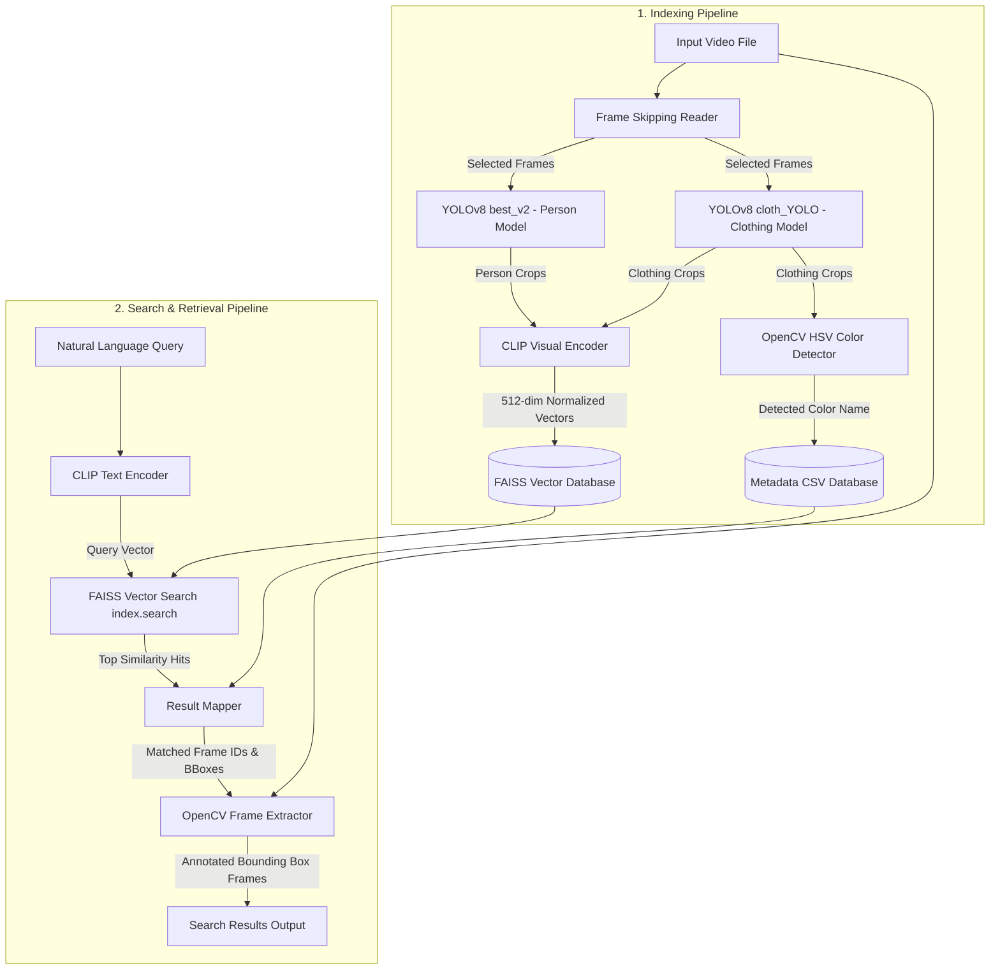

# OmniVision AI: Video Search Engine Architecture

This document details the system design and architecture of OmniVision AI. The system enables natural language query search (e.g., "a person with red shirt") across video recordings by combining dual-model object detection, heuristic color classification, semantic feature extraction, and a vector search database.

---

## Architecture Diagram

The system operates in two core pipelines: **Indexing (Database Compilation)** and **Query Retrieval (Search Engine)**.



---

## Core Components

### 1. Ingestion & Dual-Model Object Detection
- **YOLOv8 Models**:
  - **Person Model (`best_v2.pt`)**: Detects person bounds and high-visibility workwear.
  - **Clothing Model (`cloth_YOLO.pt`)**: Detects clothing items (shirts, pants, jackets, skirts, shorts, hats, bags, shoes, sunglasses).
- **Frame Skipper**: Reads frames at a configurable skip interval (default: 30 frames) to speed up database compilation and reduce redundant computational workload.

### 2. Heuristic Feature Classification (OpenCV)
- **HSV Color Detector (`get_dominant_color`)**:
  - Converts cropped clothing images from BGR to the HSV (Hue, Saturation, Value) color space.
  - Applies range-based thresholding masks for 11 target colors (`black`, `white`, `grey`, `red`, `orange`, `yellow`, `green`, `blue`, `purple`, `pink`, `brown`).
  - Matches the crop to the color mask containing the highest non-zero pixel count.

### 3. Semantic Vector Embeddings (OpenAI CLIP)
- **Visual Encoder**:
  - Utilizes `openai/clip-vit-base-patch32` to transform the detected crop images into 512-dimensional vector embeddings.
  - Automatically queries local Apple Silicon hardware acceleration (`mps`) or NVIDIA GPU (`cuda`) for fast inference.
  - Normalizes the generated embedding tensor to unit length (L2 norm) so that inner-product similarity search operates mathematically as Cosine Similarity.

### 4. Vector Database & Storage
- **FAISS (`embeddings.index`)**:
  - Facebook AI Similarity Search (FAISS) acts as the vector database.
  - Uses a flat inner-product index (`faiss.IndexFlatIP`) which handles embedding query lookups with $O(N)$ efficiency.
- **Relational Metadata Index (`video_metadata.csv`)**:
  - A Pandas-indexed database recording object properties (`frame_id`, `model`, `class_name`, `confidence`, `detected_color`, `bbox`, `crop_path`).
  - Rows in the CSV map one-to-one with the indices of the vectors stored in the FAISS index database.

### 5. Search Engine (`search.py`)
- Takes natural language text queries from console inputs (e.g. "a person with red shirt").
- Uses the CLIP text encoder to generate a normalized 512-dimensional query vector.
- Runs an inner-product search against the FAISS database to identify the top 5 nearest-neighbor crops.
- Seeks to the corresponding frame IDs in the video file, extracts the frame, overlays labeled bounding boxes around the matched objects, and saves the matches to `output/search_results/`.

---

## In-Memory Database Schema

The relational database file `output/video_metadata.csv` contains the following fields:

| Field Name | Type | Description |
| :--- | :--- | :--- |
| `frame_id` | Integer | Frame index location in the video. |
| `model` | String | Model source (`best_v2` or `cloth_YOLO`). |
| `object_id` | Integer | Detection index within the frame. |
| `class_id` | Integer | Raw class integer index. |
| `class_name` | String | Human-readable object label (e.g., `person`, `shirt`, `pants`). |
| `confidence` | Float | Model prediction confidence score. |
| `crop_path` | String | Local file path to the cropped object image. |
| `bbox` | List | Bounding box coordinates `[x1, y1, x2, y2]`. |
| `detected_color`| String | OpenCV recognized color (or `N/A` for persons). |

---

## Directory Structure

```
AI_VIDEO_SEARCH/
├── main.py                     # Main script executing indexing and player comparison
├── search.py                   # Interactive CLIP + FAISS search engine
├── best_v2.pt                  # YOLOv8 Person & Gear model weights
├── cloth_YOLO.pt               # YOLOv8 Clothing model weights
├── data.yaml                   # YOLO dataset configuration
├── output/                     # Generated results folder
│   ├── video_metadata.csv      # CSV metadata database
│   ├── embeddings.index        # FAISS vector database file
│   ├── crops/                  # Cropped object images directory (JPEGs)
│   └── search_results/         # Extracted matching search result frames
└── Architecture.md             # System architecture documentation (This file)
```

---

## Running the Pipelines

1. **Re-compiling the Database (Indexing)**:
   ```bash
   .venv/bin/python main.py
   ```
   *This loads the models, extracts crops, analyzes color, generates CLIP embeddings, and compiles the FAISS index.*

2. **Searching the Database**:
   ```bash
   .venv/bin/python search.py
   ```
   *This starts an interactive prompt allowing search queries to retrieve matched frames.*
